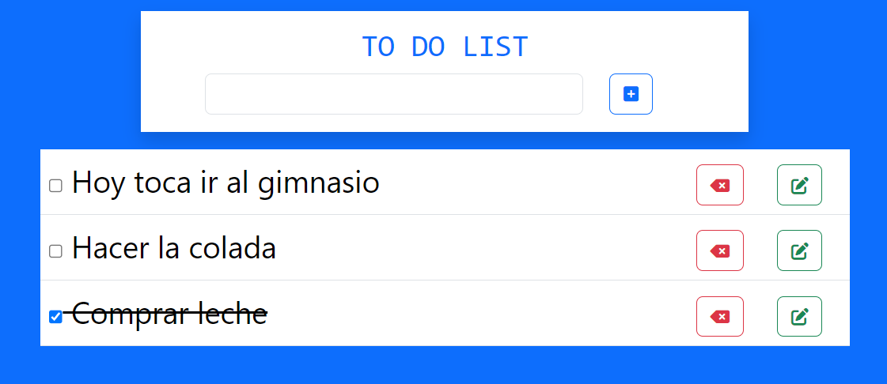

# P8-ToDo_LIST-sql

<h1>(｡◕‿◕｡) P8 - To Do List (｡◕‿◕｡)

</h1>

## 📖 Descripción
En respuesta a la creciente necesidad de herramientas eficientes de gestión
del tiempo y productividad, nuestra empresa de desarrollo de software ha
decidido embarcarse en el desarrollo de una aplicación de gestión de tareas
altamente funcional. Esta aplicación, destinada a usuarios individuales y
equipos de trabajo, tiene como objetivo principal facilitar la organización,
seguimiento y cumplimiento de tareas y proyectos en un entorno digital.

## 📺 ScreenShot

## 🖥️ Guía para su  instalación 

1. Lo primero es necesario tener instalado Xampp.Si ya lo tienes instalado puedes iniciar el servidor web con Apache, si no es así realiza su descarga en : https://www.apachefriends.org
2. Clona el repositorio en tu máquina local dentro de la carpeta htdocs de xampp, utilizando `git clone`.
2. Navega hasta el directorio del proyecto.
3. Instala las dependencias del proyecto con `composer init`.
5. Iniciar MySQL con xampp.
6. Importar base de datos `to_do_list.sql`.
7. Revisa los datos de conexion a base de datos del archivo `Controller/db_conn.php` para que coincidan con tu configuración de phpmyadmin.

## 🛠️Tecnologías necesarias

## 🪗 Realizado por:

Este proyecto ha sido realizado por:
-  [Anuskota](https://github.com/Anuskota)
